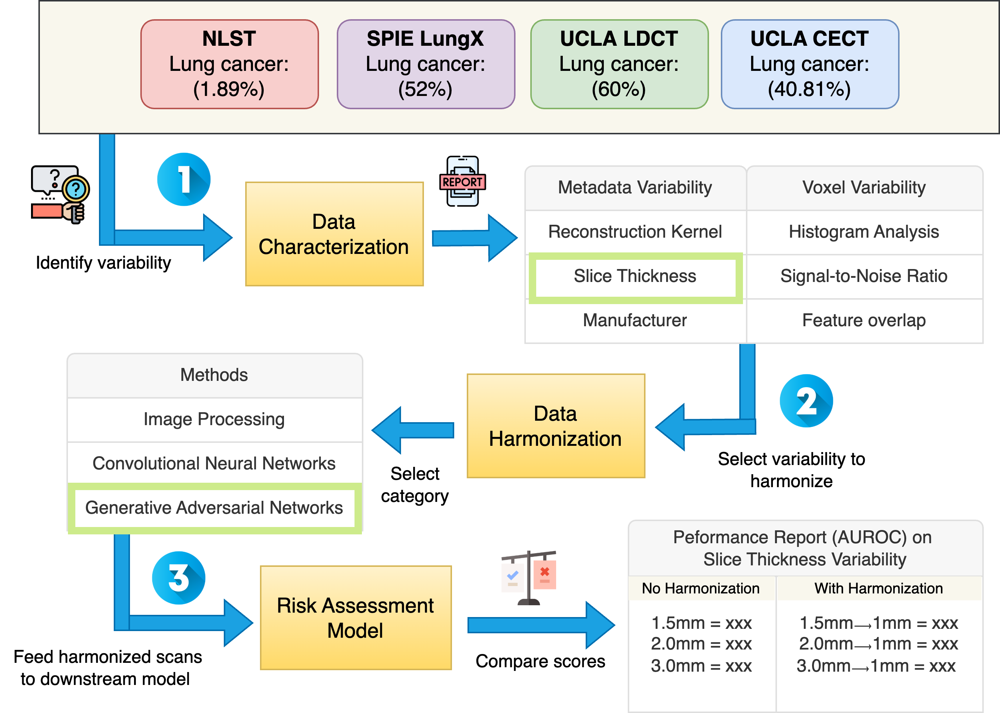

# CT-Norm: A Toolkit To Characterize and Harmonize Variability in CT

<p align="center">
  
</p>

The repository contains usage instructions for CTNorm: a module that integrates a variety of image harmonization methods into a unified framework. Deep learning based models within CTNom has been trained on UCLA LDCT dataset.

## 🚀 Getting Started

These instructions will guide you through setting up and using CTNorm.


### Step 1: 📁 **Data Requirements**
Currently, **CTNorm** supports only **[DICOM](https://pydicom.github.io/pydicom/stable/tutorials/installation.html) (`.dcm`) format**.
- A **CSV file** is required that must contain a column named `uids`, where each row corresponds to the **path of a DICOM folder**.

| uids |
|-------------------------------|
| `/data/path/to/dicom/folder1` |
| `/data/path/to/dicom/folder2` |
| `/data/path/to/dicom/folder3` |

<!-- ## 🐳 **Setting Up CTNorm with Docker**
To ensure **easy setup and reproducibility**, we recommend running CTNorm using Docker.
---
### **1️⃣ Clone the CTNorm Repository**
First, clone the CTNorm repository from GitHub:
```bash
git clone https://github.com/your-username/ctnorm.git
cd ctnorm
``` -->

### Step 2: 🐳 Setup Environment
To ensure **easy setup and reproducibility**, we recommend running CTNorm using Docker.

1️⃣ Clone the CTNorm repository:
```bash
git clone https://github.com/hsu-lab/ctnorm.git
```
2️⃣ Pull the Docker image from [Docker Hub](https://hub.docker.com/) 🐳:
```bash
docker pull litou/mii-pytorch:20.11
```
3️⃣ Run Docker in interactive mode
```bash
docker run --name=<container_name> --shm-size=<memory_size> --gpus device=<gpu_id> -v /etc/localtime:/etc/localtime:ro -v "$(pwd)":/workspace -v <path_to_input_data>:/data litou/mii-pytorch:20.11
```
**Parameters:**
* *<container_name>*: Specify the name of the container.
* *<memory_size>*: Specify the shared memory size (e.g., `2g`, `4g`, `6g`).
* *<gpu_id>*: Specify the gpu device id. If no GPU is available, this parameter can be omitted.
* *<path_to_input_data>*: Path to the input data directory, which will be mounted as `/data` in the container.

4️⃣ Install the CTNorm package locally:
```bash
cd ctnorm # Move to the project directory
pip install -e .
```

### Step 3: 🛠️ Setup Configuratiion File

The CTNorm pipeline requires a YAML configuration file to define parameters needed to run each module. Below is a breakdown of each section in **config.yaml**.
```yaml
Global:
  session_base_path: "./SESSIONS" # Base path where all session folders will be created; each run creates a new session
```
```yaml
Datasets:
  NLST:
    in_uids: "path_to_nlst_data_cases.csv" # Path to a CSV file containing UIDs (references to DICOM folders)
    in_dtype: "dcm" # Specifies input data type. Must be in DICOM format at the moment
    description: "National Lung Screening Trial dataset" # Descriptive name for the dataset
    
  SPIE:
    in_uids: "path_to_spie_data_cases.csv"
    in_dtype: "dcm"
    description: "SPIE LungX dataset"

```
- Each dataset must have in_uids, in_dtype, and description fields.
- The dataset name (e.g., `NLST`, `SPIE`) is a user-defined key and should be unique.
```yaml
Modules:
  Characterization: true
  Harmonization: true
  Robustness: true
```
- Set `true` or `false` to enable/disable a module.
```yaml
Characterization:
  input_datasets:
    - name: NLST  # ✅ Valid - Must match a dataset in the `Datasets` section
    - name: SPIE  # ✅ Valid - Must match a dataset in the `Datasets` section
    - name: XYZ   # ❌ Invalid - Doesn't match any dataset in the `Datasets` section
```
- The dataset name must match one of the datasets defined in the `Datasets` section.
- If multiple datasets are provided, each must be listed separately under input_datasets.

> The **Harmonization module** can run in two different modes

1️⃣ Running Harmonization in Test Mode – Uses a pretrained model to harmonize input datasets.<br>
```yaml
Harmonization:
  mode: "test"  # Runs harmonization in inference mode
  input_datasets:
    - name: NLST  # ✅ Valid - Must match a dataset in the `Datasets` section
      in_uids: "path_to_nlst_subset.csv"  # 🔹 (Optional) Overrides the `in_uids` from the `Datasets` section if specified
  models:
    - name: SNGAN  # The model being used
      pretrained_G: "./pretrained_weights/SNGAN/latestG-1-1.pth"  # Path to the pretrained generator model
  param:
    tile_xy: 512  # Tile size along X & Y
    tile_z: 32  # Tile size along Z
    z_overlap: 4  # Overlap between slices
    gpu_id: 0  # GPU device ID
    out_dtype: "dcm"  # Output data format (must be DICOM)
```
- The **Harmonization module** supports multiple models for CT harmonization. Below are the available model options:<br>

| **Model Name** | **Description** |
|--------------|----------------|
| **SNGAN** | Spectral Normalization GAN, used for image-to-image translation. |
| **WGAN** | Wasserstein GAN, improves stability of training for generative models. |
| **Pix2Pix** | Conditional GAN, useful for paired image transformation. |
| **SRResNet** | Super-Resolution ResNet, designed for image enhancement. |
| **RRDB** | Residual-in-Residual Dense Block, used in SRGAN-style super-resolution tasks. |
| **BM3D** | A non-deep learning method for denoising medical images. |

- We have provided the pretrained weights here. Update the `pretrained_G` parameter depending on the model accordingly.

For **BM3D**, only one **optional parameter** can be specified:
```yaml
models:
  - name: BM3D
param:
  noise_type: "psd"  # Optional, choose between "psd" or "std"
```

2️⃣ Running Harmonization in Training Mode – Trains a new harmonization model from scratch.<br>
```yaml
Harmonization:
  mode: "train"  # Runs harmonization in training mode
  input_datasets:
    - name: NLST  # Source dataset ->  ✅ Valid - Must match a dataset in the `Datasets` section
      tar_uids: "/path_to_nlst_target_cases.csv"  # Target dataset (paired data for training)
  models:
    - name: SNGAN  # Model name
      model_config:
        nc_in: 1  # Number of input channels
        nb: 8  # Number of residual blocks
        nf: 64  # Number of feature maps
        nc_out: 1  # Number of output channels
  param:
    use_shuffle: true  # Shuffle training data
    n_workers: 1  # Number of workers for data loading
    batch_size: 6  # Batch size
    gpu_id: 0  # GPU device ID
    tile_xy: 64  # Tile size along X & Y
    tile_z: 32  # Tile size along Z
    train_param:
      lr_G: 1e-5  # Learning rate for generator
      weight_decay_G: 0  # Weight decay for generator
      beta1_G: 0.5  # Beta1 for Adam optimizer (Generator)
      beta2_G: 0.999  # Beta2 for Adam optimizer (Generator)
      lr_D: 1e-5  # Learning rate for discriminator
      weight_decay_D: 0  # Weight decay for discriminator
      beta1_D: 0.5  # Beta1 for Adam optimizer (Discriminator)
      beta2_D: 0.999  # Beta2 for Adam optimizer (Discriminator)
      pixel_weight: 1  # Weight for pixel loss
      pixel_criterion: "l1"  # Loss function for pixel-wise loss
      gan_weight: 5e-3  # Weight for GAN loss
      lr_scheme: "MultiStepLR"  # Learning rate scheduling
      lr_steps: [20000, 40000, 60000]  # Steps for learning rate decay
      restarts: null  # Restart epochs (if any)
      restart_weights: null  # Restart weights (if any)
      lr_gamma: 0.5  # Decay factor for learning rate
      manual_seed: 42  # Random seed for reproducibility
      D_init_iters: 1  # Number of iterations for discriminator pretraining
      print_freq: 10  # Frequency of printing logs
      save_checkpoint_freq: 5e3 # Frequency of saving model checkpoints
      niter: 50e3  # Total number of training iterations
```
🚨 **Note:** **Slice thickness harmonization is NOT performed by default.**  
To enable it, you must **explicitly define the `scale` parameter** under `param`:
```yaml
param:
  scale: 2  # Converts 2mm slice thickness to 1mm
```
- Example: If the input scans are 2mm slices, setting `scale`: 2 will train the model to generate 1mm slices.
- If scale is not specified, the model will not alter slice thickness.
- If `scale` is specified, ensure that the target and source scans have the correctly scaled slice thicknesses.