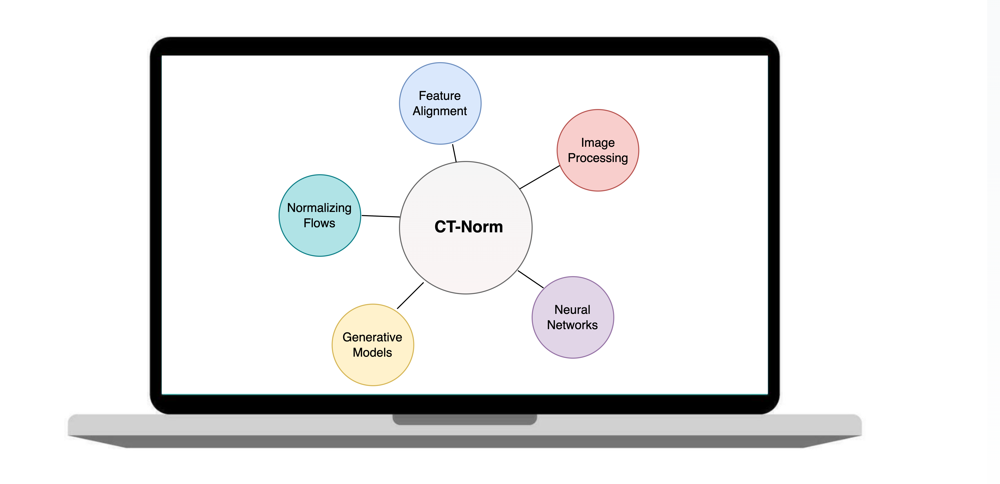

# CTNorm

<p align="center">
  
</p>

The repository contains usage instructions for CTNorm: a module that integrates a variety of image harmonization methods into a unified framework. Deep learning based models within CTNom has been trained on UCLA LDCT dataset.

## 🚀 Getting Started

These instructions will guide you through setting up and using CTNorm.

### Step 1: 📁 Setup Data

**Input Data Formats:**
- CTNorm can process images in [DICOM](https://pydicom.github.io/pydicom/stable/tutorials/installation.html) (🔗) and [NIfTI](https://nipy.org/nibabel/) (🔗) formats only.

**Data Structure:**
- Organize your test data in the following directory structure:
> If data format is `Nifti`, combine all cases in one directory. If data format is `Dicom`, seperate cases by folders.
```
├── 📂 Nifti_Files
│   ├── case_1.nii.gz
│   ├── case_2.nii.gz
│   ├── ...
│
├── 📂 Dicom_Files
│   ├── case_1
│   │   ├── dicom_0.dcm
│   │   ├── dicom_1.dcm
│   │   ├── dicom_2.dcm
│   │   ├── ...
│   ├── case_2
│   │   ├── dicom_0.dcm
│   │   ├── dicom_1.dcm
│   │   ├── dicom_2.dcm
│   │   ├── ...
│   ├── ...
```

### Step 2: 🛠 Setup Environment

CTNorm is containerized using Docker for easy setup and reproducibility.

- Pull the Docker image from [Docker Hub](https://hub.docker.com/) 🐳:
  
```bash
docker pull ayadav01/hsulab_ctnorm1.0:testing
```

### Step 3: 🖥 Usage Instructions
 **Command Line Execution**:

- Download the `main.py` script and run it within the Docker container using the following command:
```
docker run --shm-size=<memory_size> --gpus all -v /etc/localtime:/etc/localtime:ro -v "$(pwd)":/workspace -v <path_to_input_data>:/data ayadav01/hsulab_ctnorm1.0:testing python /workspace/main.py --model=<model_name> --in_path=/data --in_type=<input_file_type> --out_path=/workspace/out --gpu_id=<gpu_id>
```

**Parameters:**

* *<memory_size>*: Specify the shared memory size (e.g., `2g`, `4g`, `6g`).
* *<path_to_input_data>*: Path to the input data directory, which will be mounted as ***/data*** in the container.
* *<model_name>*: Model to use (e.g., `SNGAN`, `WGAN`, `SRResNet`, `RRDB`, `BM3D`). Note: Case sensitive.
* *<input_file_type>*: File type of the test cases (e.g., `nii`, `nii.gz`, `dcm`).
* *<gpu_id>*: GPU ID for running inference. If no GPU is available, this parameter can be omitted. If your machine does not have a GPU, also remove the ***--gpus all*** argument.

> Note: The working directory (i.e., where `main.py` is located) will be mounted to ***/workspace*** in the container. Harmonized images will be saved to ***/workspace/out*** directory unless specified otherwise.

